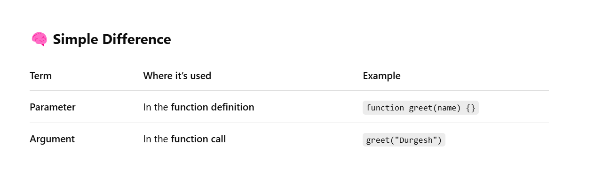

# Namaste React Notes for Revision 

**Parcel Functions**

- Dev Build
- Local Server
- HMR (Hot Module Replacement)
- File Watching Algorithm (written in C++)
- Caching - Faster Builds
- Image Optimization
- Minification of files for production 
- Bundling
- Compressing of files
- Consistent Hashing
- Code Splitting
- Differential Bundling - support older browsers also
- Diagnostics - Showcasing detailed error in terminal
- Error Handling
- HTTPs
- Tree Shaking Algorithm - Remove unused codes from code base
- Different Dev and Prod bundles

**Note --> Any Code that can be automatically generated SHOULD NOT be pushed to GitHub**

# Episode-02 | Igniting our App 

- Important Git Commands ---> git add . ---> git commit -m "Commit Message" ---> git push origin main

# Episode-03 | Laying the foundation

- Instead of writing commands multiple times in terminal for build, we can write scripts in package.json in scripts node to start our project and build for dev and prod builds

-  To start the project in Dev mode --> npx parcel index.html => npm run start => npm start

- To make the prod build --> npx parcel build index.html ==> npm run build

- How React.createElement Works?

- React.createElement ==> JS Object ==> after rendering HTML Element

- JSX (is not HTML in JavaSript, it is HTML like or XML like syntax) => JavaScript syntax using which it is easier to create HTML Element

**Note --> React and JSX are two different things**

- JSX (transpiled before it reached the JS Engine) -- Done by PARCEL -- actually done by Babel (a JavaScript Compiler)

- How JSX Works?

- JSX => React.createElement => ReactElement - JS Object => after rendering HTML Element

- Babel is converting JSX to React.createElement

 **PRO TIP --> Read about the Documentation of any New Language or whatever else which you are learning**

- Attributes to JSX are given using **Camel Case**(Ex: phoneNumber, createElement)

- JSX written in multiple lines needs to be wrapped in brackets () for Babel to understand the start and end point of the JSX code (Not mandatory for Single line JSX Code)

- What is React Component ?

- In React, components are the building blocks of the user interface. They are reusable, independent pieces of UI that manage their own state and behavior

1- Class Based Components (OLD Method)

2- Functional Components (NEW Method)

- What is React Functional Component?

- Just a JavaScript Function
(These are simple JavaScript functions that return JSX (UI elements))
**Note - Any React Component Name should start with CAPITAL LETTER**

- A JavaScript Function which returns a React Element is called **Functional Component**

- What is Class Based Components ?

- These are ES6 class-based components that extend React.Component and use the render() method to return JSX.

- What is Component Composition in React?

- Component inside a component. (Component Composition is a technique in React where you combine multiple smaller components to build complex UIs)

- Any JavaScript Code can be written inside the JSX (JavaScript XML) (i.e inside () )

- React Element and React Components can be inserted in each other using curly braces {} inside JSX

- Any piece of JavaScript code should not be called before initialization

- JSX prevents Cross-Site Scripting (XSS) attacks by sanitizing any dynamic content inside {} before inserting it into the DOM. This prevents malicious scripts from running

# Episode - 04 | Talk is Cheap, Show Me the Code

- For Front End Development **Wireframe** is the first and foremost important thing

- Inline CSS is given as a JavaScript Object
-For Example : const styleCard = {backgroundColor: "yellow"}

- What is Props (Properties) in React ?

- Props (short for "Properties") in React are used to pass data from a parent component to a child component. They make components reusable and dynamic. Props are read-only and cannot be modified inside the child component

- **Passing  a Prop to a component is just like passing an argument to a function**

- For Dynamic Data Population we are going to use Props in a component

- What is Config Driven UI ?

- Controlling UI using the Data or Config which comes from Backend is called Config Driven UI

 - What is Optional Chaining in React ?

 - Optional Chaining (?.) is a JavaScript ES11 (ECMAScript 2020) feature that helps safely access deeply nested object properties without causing errors if a property is null or undefined

- Where to Use Optional Chaining in React?

-  API responses (data?.property)
- Props (props?.value)
- State variables (state?.key)
- Arrays (array?.[0]?.property)
- Event handlers (event?.target?.value)

- Why is the key Prop Necessary in .map()?

- React uses keys to identify which elements have changed, been added, or removed.

- Without keys, React re-renders the entire list, leading to performance issues.

- With keys, React can efficiently update only the changed items, improving performance. 

- **Writing a key is necessary while using the map function for performance optimisation of the code**

- **Never use Index as a Key inside map function**

# Episode-05 | Let's Get Hooked

- The beauty of using a framework or a library is to make developer experience easy. To write less code and do more on the web page

- The best industry practice is to make separate files for separate components instead of writing the whole code in a single file

- *Note ---> Before importing a component, we need to export that component in the component.js file. For Example - (export default ***Component***;)

- Best Industry Practices - Never put any Hard coded data (String) in the components Folder. They should be put inside utilities (utils)

- **A single module or component.js file cannot have multiple default exports. For this purpose comes Named Export. Example - export const Header = () => {return <h1>Welcome to TummyKart!</h1>;};**

- Types of Imports and Exports in React 

-  Default Export/Import

export default Component;
import Component from "path";

- Named Export/Import - Used for Exporting multiple things from the same file. Named Export is imported by writing inside the curly braces ({ }).
**For Example - import { Header, Footer } from "./components/Header";**

- export const Component;
import {Component} from "path";

- Best practice is to use default export unless there are multiple components needed to be exported.

- **Ques** - Can I use a default export along with a named export?
For example- 

export const Header=()=>{return()};

export default Header;

- 📌 Exporting in Same File:

const Header = () => <_h1>Welcome!<_/h1>;

- export { Header };  // Named export
- export default Header; // Default export

- 📌 Importing in Another File:

- import Header, { Header as NamedHeader } from "./components/Header";

- **Why React is Fast ?** 
- React is Fast and Efficient in DOM Manipulation to maintain Data and UI layer to be consistent with each other.

- State Variable ? - Super Powerful Variable - with the use of React Hooks(which is a normal JS function which is prebuilt)

- React Hooks ?

- Normal JS utility function 
- Two important React Hooks 
- useEffect()
- useState() -  Used to generate Superpowerful State Variables in react. Needs to be imported before use inside a component like (import {useState} from "react";).
Why is it called a State Variable ? - because it maintains the state of component.
- How to create a State Variable ?

- const [variableName, setvariableName] = useState(ValueTobePassed);

- useState() returns an Array.We can also write the above code like below (Array Destructuring) -

- const arr = useState(ValueTobePassed);

- const variableName = arr[0];

- const setvariableName = arr[1];

- **Whenever a StateVariable updates, React re-renders the components.**

- Reconciliation Algorithm (React Fiber) - Reconciliation is the process React uses to efficiently update the Actual DOM by comparing the new Virtual DOM with the previous Virtual DOM and applying only the necessary changes. ***For more Details - https://github.com/acdlite/react-fiber-architecture ***

- Diffing Algorithm - When the state changes, React compares the new Virtual DOM with the previous one.

- Actual DOM vs Virtual DOM in React

- 1️⃣ What is the Actual DOM?

- The Actual DOM (Document Object Model) is the standard representation of the UI elements in the browser.

- Manipulating the Actual DOM is slow because every change requires the browser to repaint and reflow the page.

- Example: If you update a single item in a list, the browser re-renders the entire list instead of just updating that one item.

- 📌 Limitations of the Actual DOM:

- Slow updates due to re-rendering the entire page.

- Performance issues in large applications.

- Increased memory usage.

- 2️⃣ What is the Virtual DOM?

- The Virtual DOM (VDOM) is a lightweight copy of the Actual DOM that React keeps in memory.

- 📌 How Virtual DOM Works:

- React creates a virtual representation of the UI in memory.

- When the state changes, React compares the new Virtual DOM with the previous one (using a process called "diffing").

- React updates only the changed parts of the Actual DOM instead of re-rendering everything.

- 🚀 Advantages of Virtual DOM:
- ✅ Faster updates – React only updates necessary parts of the UI.
- ✅ Efficient rendering – Uses "reconciliation" to apply minimal changes.
- ✅ Better performance – Reduces the number of direct updates to the Actual DOM.

- **React uses the Virtual DOM (VDOM) to improve performance by minimizing direct interactions with the Actual DOM.**

# Episode-06 | Exploring the World

- Monolith Architecture Vs Microservices Architecture

- A **monolithic architecture** is a single unified codebase where all features and components of an application (like UI, business logic, database access) are tightly coupled and run as a single service.

- ✅ Characteristics: 
- One large codebase
- Deployed as a single unit
- All modules are tightly integrated

- A **microservices architecture** splits the application into independent, loosely coupled services, each responsible for a specific feature or business logic. These services communicate via APIs (typically REST).

- ✅ Characteristics:
- Each service is independently deployable
- Services can use different languages/technologies
- Better modularity and separation of concerns

- Different Microservices run on their own specified ports. Atlast all these ports can be mapped to Domain name.

-  **How do different micorservices connect with each other ?**

- 🛣 Step-by-Step: How it all works (like a relay team 🏃‍♂️)
1. ✅ User makes a request
👉 You open the TummyKart app and click “Order Now”.

2. 🌐 API Gateway receives your request
👉 Think of this as the front desk — it accepts your order and decides which service should handle it.

Example: If you're placing an order → it forwards it to Order Service

3. 🔁 Microservices talk to each other
👉 The Order Service needs more info before placing an order:

It talks to Restaurant Service to check menu & prices

It calls User Service to get your delivery address

Then it calls Payment Service to handle payment

📞 These calls are made using:

REST APIs (just like how browsers talk to websites)

or gRPC (faster communication style for backend-to-backend)

4. 📢 Some services emit messages
👉 After payment is done, Payment Service doesn’t call Notification directly.

Instead, it sends a message like:

“Payment Success for Order #123”

Then, Notification Service listens for this and sends you a confirmation email or SMS.

This is called event-based or asynchronous communication.

5. 🗄️ Each service has its own database
User Service → user database

Restaurant Service → menu database

Order Service → order database

👉 They don’t share databases, so they don’t mess up each other’s data.

- Two Approaches how UI Applications fetch the data from Backend 

1. Page Loads --> API Hits --> Render the Data

2. Page Loads --> Just Render UI ---> API Hits --> Re-render the UI with API DATA

***Note --> Approach Second is best because it gives better UX (User Experience)***

- React's render cycles are very fast, it has one of the best and fastest rendering mechanism.

- Arguments (Function Call) vs Parameters (Function Definition)

- 

- useEffect(callbackFunction, Dependencies) - After the rendering of body component the callback function of useEffect is called.

**For example - useEffect(()=>{console.log("useEffect is called")}, []);**

- If you have to do something after the rendering component then we have to write useEffect();

- **Using Shimmer UI we load a fake page (skeleton) until we get the real data from the API's.** Used for Better User Experience

- Conditional Rendering - The Rendering which is done on the basis of a condition is called Conditional Rendering.

- **Whenever state variable changes, React will re-render the whole component**

- ***Why, How, When should be the questions for Learning anything New***

- onChange={e => setSearchQuery(e.target.value)} is required in an input box for proper working.

- **Whenever state variables update, react triggers a reconciliation cycle (re-renders the component)**

- Fetch/XHR in the network tab of inspect elements gives us all the API Calls

**// Use Update API and build infinite scroll for TummyKart App**

# Episode-07 | Finding the Path

- If no dependency array => useEffect is called on every render

- if dependency array is empty = [] => useEffect is called on initial render(just once)

- If dependency array is [exampledependency] => useEffect is called everytime exampledependency is updated.

- **Never Create Hooks outside of the body of component**

- **Always call useState() on the top where component starts to avoid inconsistency**
- **Never Use Hooks inside an if else Block(condition), foreach loop, functions**

- For Developing Routes, we have to create Routing **Configuration-(Information that tell browser router what will happen on a specific path).**

- Two important components provide by react-router-dom are - 

1. createBrowserRouter

2. RouterProvider - Provides the routing configuration to our App

- Whenever a function starts with "use" --> Hooks

- **useRouteError() is a Hook Provided by react-router-dom for Detailing the Errors**

- 🚸 What Are Children Routes?
Children routes allow you to nest routes inside a layout. Think of it like a parent-child relationship:

🧭 / → Home or Main Layout

📄 /about → a page inside the main layout

📄 /contact → another child page

- Outlet is like a placeholder for rendering nested/child routes.

- **Never ever use an Anchor Tag in react because it refreshes the whole new page. (Navigates to a new page only by Reloading the Whole Page)**

- What is Link?
The <Link> component is like an anchor tag (<a>) but made for React Router. It enables client-side routing, meaning navigation is handled by JavaScript (no full page reload).

- 🧠 What Happens Behind the Scenes?
Instead of doing a full reload like <a href="/about">About</a>,
<Link to="/about">About</Link> updates the URL and component using the routing system.

Makes the app faster and smoother. ✨
- **Link is a component which is given to us by react-router-dom and behind the scenes Link is using Anchor Tag in HTML of browsers.**
- React Applications are called as (SPA) Single Page Application.

-  🧠 What is an SPA?
A Single Page Application is a web app that loads a single HTML page and dynamically updates the content without refreshing the entire page as the user navigates.

- Routing in Web Apps

- Client Side Routing - The app loads once. When users click links, JavaScript updates the URL and dynamically renders components, without reloading the page.

- Server Side Routing - Every time a user clicks a link, the browser sends a request to the server. The server processes the request and sends back a new HTML page.

- 🔄 Why Client-Side Routing is Awesome
✅ Faster transitions
✅ Feels like a real app
✅ Reduces server load
✅ Easy to handle private routes, lazy loading, etc.

- 📌 What is Dynamic Routing?
Dynamic routing means the URL path can change based on a variable, like a product ID, username, blog slug, etc.

Example:

1)- /user/123 → Show user with ID 123

2)- /product/shoes → Show the product page for "shoes"

- How to Implement --> path="/user/:id"

- 🔍 What is useParams?
- useParams is a hook provided by React Router that lets you access the dynamic pieces of the URL (called route parameters) in a React component.

